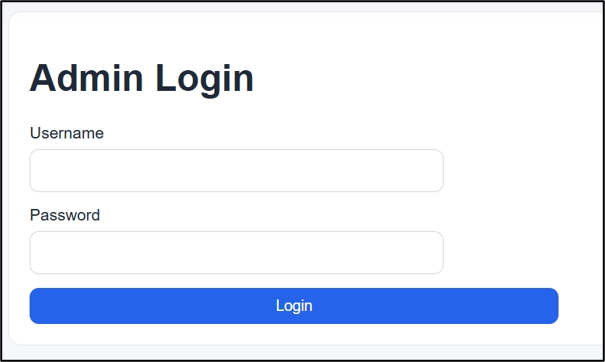
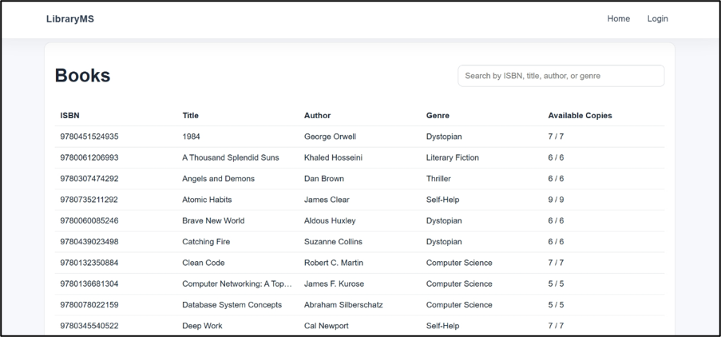
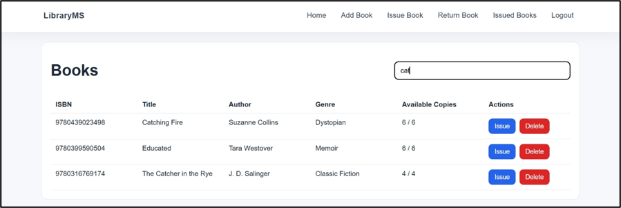
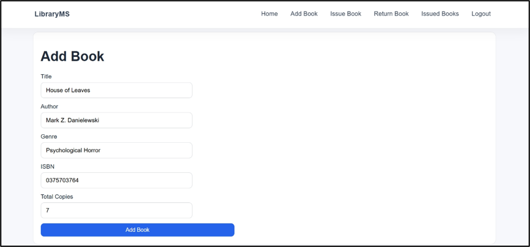
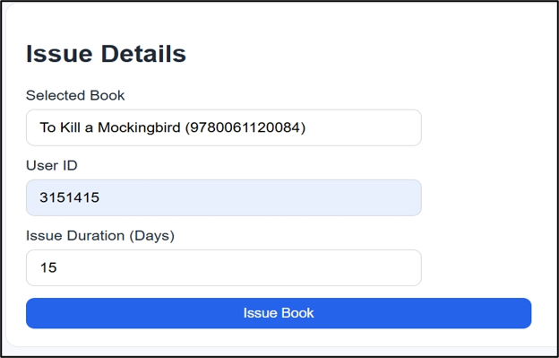
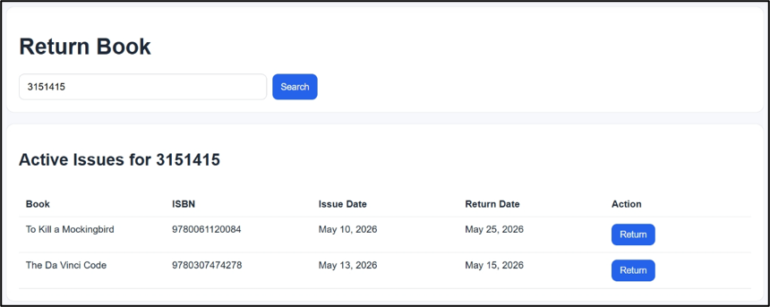
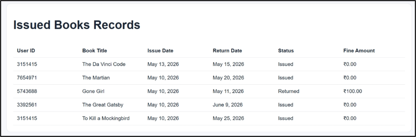

# Library Management System

## Project Overview

Library Management System is an academic Django web application that implements core library operations: managing a catalog of books, issuing and returning books, and tracking issued records. The implementation is concise, maintainable, and suitable for demonstration in a professional portfolio.

## Features

- Admin and user authentication (session-based)
- Admin dashboard: add, delete and manage books
- Book listing and search
- Issue books to users with configurable duration
- Return books and automatic overdue fine calculation
- View issued books records for administration
- User dashboard to view currently issued and previously returned books
- Demo book data provided via migrations

## Technologies Used

- Backend: Python, Django (see `requirements.txt` for exact versions)
- Database: SQLite (development)
- Frontend: Django templates, HTML5, CSS, vanilla JavaScript
- Other libraries: `asgiref`, `sqlparse` (listed in `requirements.txt`)

## System Architecture

The project follows Django's Model-View-Template (MVT) architecture:

- Templates: HTML templates live in the top-level `Templates/` folder and are rendered by view functions.
- Static files: CSS and JavaScript are under `static/` (`static/css/app.css`, `static/js/*.js`) and are referenced by templates.
- Models: data models are defined in `LibManager/models.py` and include `Book`, `IssuedBook`, and `User` entities.
- Views: request handlers and business logic are implemented in `LibManager/views.py` for authentication, book CRUD, issuing, returning, and dashboards.
- URLs: routing is configured in `LibraryManagementSystem/urls.py` and `LibManager/urls.py`.
- Database: Django ORM with migrations defines the schema and demo data seeding.

## Project Structure

```
Library-Management-System/
├─ LibraryManagementSystem/
│  ├─ settings.py
│  ├─ urls.py
│  ├─ wsgi.py
│  └─ asgi.py
├─ LibManager/
│  ├─ migrations/
│  │  ├─ 0001_initial.py
│  │  ├─ 0002_upgrade_models.py
│  │  ├─ 0003_seed_books.py
│  │  └─ 0005_seed_users.py
│  ├─ models.py
│  ├─ views.py
│  ├─ urls.py
│  └─ admin.py
├─ Templates/
│  ├─ index.html
│  ├─ admin_login.html
│  ├─ login.html
│  ├─ user_login.html
│  ├─ books.html
│  ├─ add_book.html
│  ├─ issue_book.html
│  ├─ return_book.html
│  ├─ issued_books.html
│  └─ user_dashboard.html
├─ static/
│  ├─ css/app.css
│  └─ js/books.js, js/nav.js
├─ screenshots/
│  ├─ admin-login.png
│  ├─ home-page.png
│  ├─ book-search-page.png
│  ├─ add-book-page.png
│  ├─ issue-book-page.png
│  ├─ return-book-page.png
│  └─ issued-books-records-page.png
├─ manage.py
├─ requirements.txt
└─ README.md
```

## Installation and Setup

1. Clone the repository:

```powershell
git clone <repo-url>
cd Library-Management-System
```

2. Create and activate a virtual environment, then install dependencies:

```powershell
python -m venv venv
venv\Scripts\Activate.ps1
pip install -r requirements.txt
```

3. Create a local `.env` from the example and set required values:

```powershell
copy .env.example .env
# Edit .env to set DJANGO_SECRET_KEY and any optional values
```

4. Run migrations to create the local database and optional demo data:

```powershell
python manage.py migrate
```

5. (Optional) Create a local superuser for administrative access:

```powershell
python manage.py createsuperuser
```

6. Start the development server and open the application:

```powershell
python manage.py runserver
# Open http://127.0.0.1:8000/ in your browser
```

## Database Information

- SQLite is used for local development (`db.sqlite3`).
- The schema and demo book data are created by Django migrations. Run `python manage.py migrate` to recreate the database locally.
- User seeding (if provided) is controlled by migration logic and environment variables; consult `LibManager/migrations/0005_seed_users.py` for details.

## Screenshots

- Admin login  
  

- Home / Books listing  
  

- Book search / details  
  

- Add Book page  
  

- Issue Book page  
  

- Return Book page  
  

- Issued Books records  
  

## Future Enhancements

- Migrate authentication to Django's built-in `User` model and use the admin interface for administration.
- Add unit and integration tests and CI for automated verification.
- Replace SQLite with PostgreSQL (or other production-grade DB) for deployments.
- Implement role-based access control and finer-grained permissions.

## Author

Vivek Kumar Mandal
